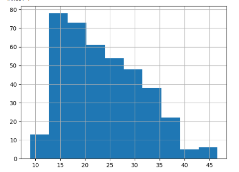
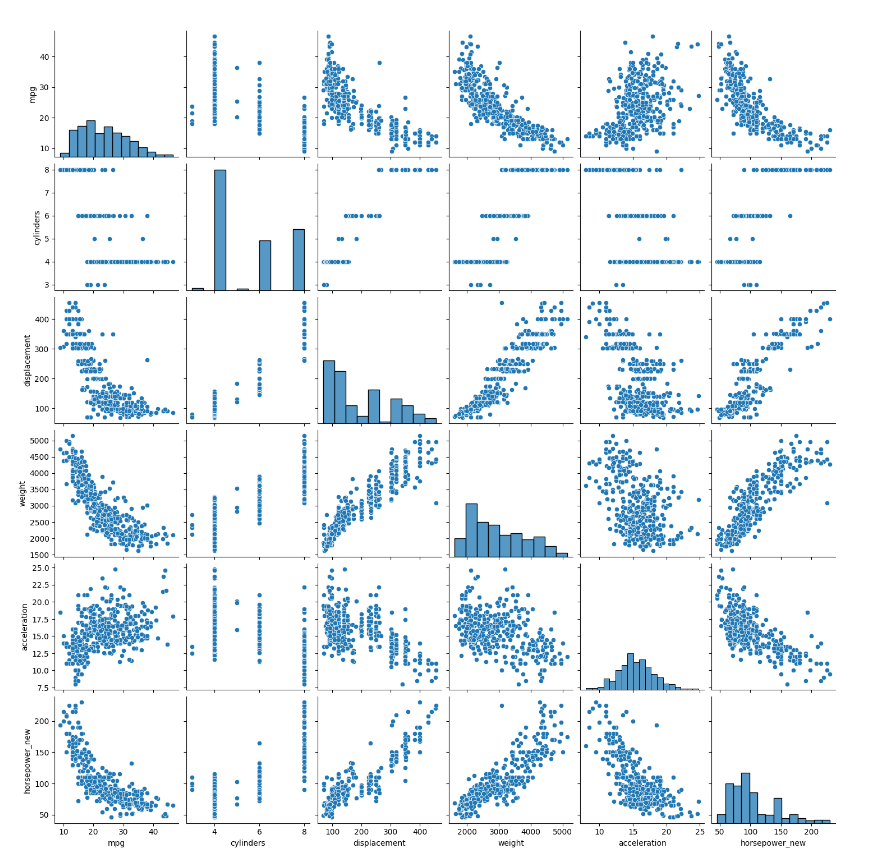
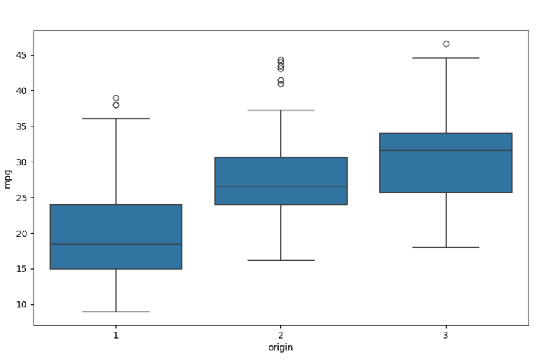
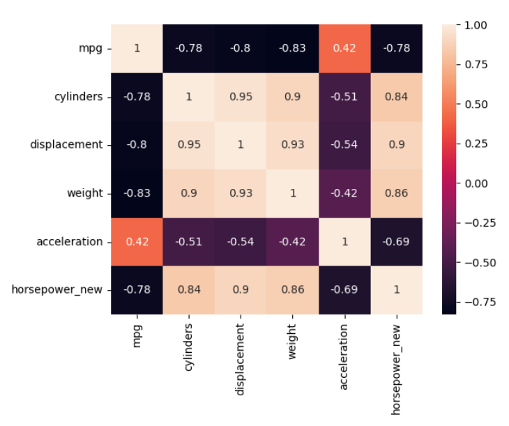
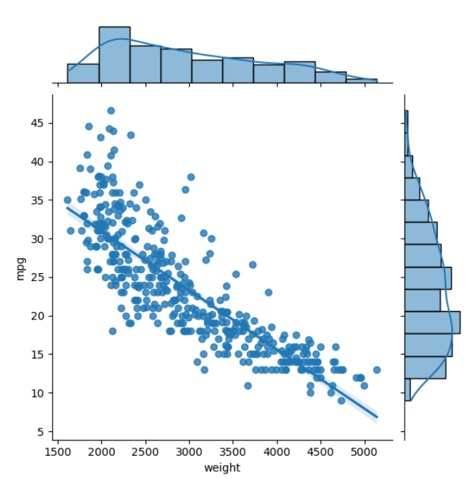
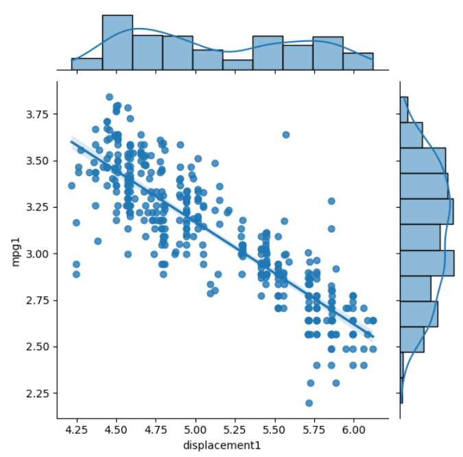
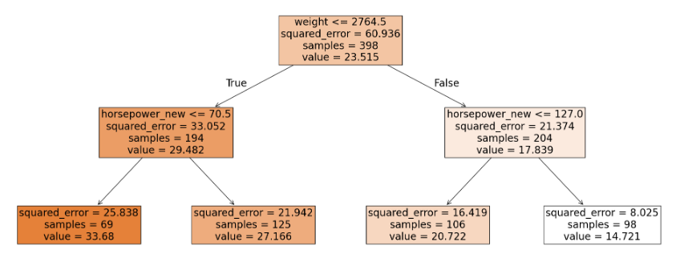
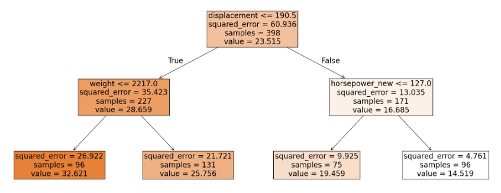

# Auto MPG Regression — Predicting Fuel Efficiency

Regression analysis of the classic Auto MPG dataset (car models collected at a US university in 1983): data cleaning, exploratory analysis, and comparison of multiple regression approaches — linear, non-linear (linearized via log transform), polynomial (with Ridge/Lasso regularization), and decision tree — to predict a car's fuel efficiency (`mpg`).

## About the project

**Goal:** build at least two regression models (linear and non-linear, the latter linearized via a log transformation) explaining the relationship between `mpg` and other features — `cylinders`, `displacement`, `horsepower`, `weight`, `acceleration`, `model year`, `origin`, `car name` — compare their quality, and use the best one to make a prediction.

**What was done:**
- Data cleaning: fixing the `horsepower` column (non-numeric values, missing data imputed by group means based on `origin` and `model year`)
- Distribution analysis of quantitative features (histograms, pairplot, Shapiro–Wilk normality test)
- Analysis of categorical features' influence on `mpg` (boxplots by `origin`, `model year`, `cylinders`; Kruskal–Wallis test)
- Correlation analysis between quantitative features (Pearson correlation, heatmap)
- Linear and log-linearized (power-law) regression models, with preprocessing handled via `scikit-learn` `Pipeline` / `ColumnTransformer` (`StandardScaler` + `OneHotEncoder`), each with a reduced and a full feature set
- Polynomial regression (degree 3), reduced and full feature sets, built as an end-to-end `Pipeline`
- **Ridge and Lasso regularization** applied on top of the same standardized polynomial features used by the full polynomial model, to address its overfitting
- **Decision Tree Regression**, reduced and full feature sets, with tree visualization and a sample forecast
- Model comparison by R² (train/test) and MSE (train/test) across all 8 models, plus a sample forecast for a new car
- Final conclusion on the best-performing model

**Key finding:** the full polynomial model overfits noticeably (high R² on train, much lower on test). Applying Ridge/Lasso regularization to the same polynomial features closes most of that gap and improves test R², confirming that regularization meaningfully improves generalization here. The log-linearized non-linear regression and the full decision tree also perform strongly. Exact metric values depend on the dataset used — re-running the notebook on your own `auto-mpg.csv` will reproduce the full comparison table.

## Example visualizations

**Distribution of fuel efficiency (mpg)**



**Pairwise relationships between quantitative features**



**Fuel efficiency by car origin**



**Correlation heatmap of quantitative features**



**Weight vs mpg — linear fit**



**Log(displacement) vs log(mpg) — linearized power-law fit**



**Decision tree (simplified)**



**Decision tree (full feature set)**



## Repository structure

```
├── Cars_Regression_final.ipynb   # main analysis notebook
├── auto-mpg.csv                  # dataset (add this — see "How to run")
├── *.png                         # charts used in the README
└── README.md
```

## Stack

`Python` · `pandas` · `numpy` · `matplotlib` · `seaborn` · `scipy` · `statsmodels` · `scikit-learn`

## How to run

1. Clone the repository
2. Place the `auto-mpg.csv` dataset in the project folder (not included — see note below)
3. Open `Cars_Regression_final.ipynb` in Jupyter Notebook / Google Colab
4. Install dependencies: `pip install pandas numpy matplotlib seaborn scipy statsmodels scikit-learn`
5. Run the cells in order
